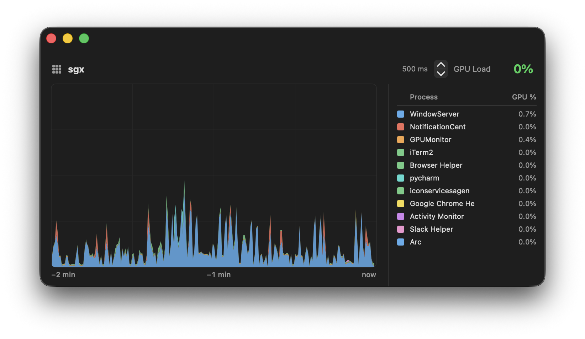

# GPU Monitor

A lightweight, native macOS menu bar app for real-time GPU utilization monitoring with historical visualization and per-process breakdowns.


---

## Features

- **Menu bar widget** — always-visible GPU load indicator with color-coded status (green / yellow / red)
- **Real-time chart** — stacked area chart showing GPU usage over the last 2 minutes
- **Per-process breakdown** — see exactly which processes are consuming GPU resources
- **Adjustable sampling rate** — configure the update interval from 100 ms to 2000 ms
- **Dark mode** — toggle between light and dark themes from the menu bar
- **Zero dependencies** — pure Swift, built on IOKit and SwiftUI

## Screenshots



## Requirements

- macOS 13.0 (Ventura) or later
- Apple Silicon or Intel Mac
- Xcode Command Line Tools (for building from source)

## Installation

### Build from Source

```bash
git clone https://github.com/your-username/GPU-Monitor.git
cd GPU-Monitor
./build.sh
open ./GPUMonitor.app
```

The build script compiles a release binary with Swift Package Manager and packages it into a self-contained `.app` bundle — no Xcode project required.

### Manual Build Steps

```bash
swift build -c release
# The build.sh script then creates the .app bundle structure automatically
```

## Usage

Launch `GPUMonitor.app`. It runs entirely in the menu bar — there is no Dock icon.

| Action | Result |
|---|---|
| Click the menu bar widget | Open the main monitoring window |
| Click **Dark Mode** | Toggle light / dark theme |
| Click **Quit** | Exit the application |
| Adjust the **Interval** stepper | Change the sampling rate (100–2000 ms) |

## How It Works

GPU Monitor uses **IOKit** to query GPU hardware counters directly from the macOS kernel — no third-party tools or background daemons required.

- **Aggregate GPU load** is read from `IOAccelerator` entries via `IOServiceGetMatchingServices`.
- **Per-process GPU time** is sampled from `AGXDeviceUserClient` IOKit entries, which expose accumulated GPU nanoseconds per Metal command queue.
- Samples are collected in an `async` loop and stored in a rolling 2-minute window. The chart maps each sample to a pixel column to prevent temporal drift during rendering.

### Color Coding

| Load | Color |
|---|---|
| < 40% | Green |
| 40–70% | Yellow |
| > 70% | Red |

## Configuration

All runtime configuration is available from the main window UI — no config files needed.

| Setting | Default | Range | Description |
|---|---|---|---|
| Sample interval | 1000 ms | 100–2000 ms | How often GPU metrics are polled |
| Dark mode | off | on / off | Persisted across launches via `UserDefaults` |
| History window | 2 minutes | — | Fixed rolling window shown in the chart |
| Tracked processes | top 20 | — | Maximum number of processes shown in the legend |

## Project Structure

```
GPU-Monitor/
├── Package.swift                    # Swift Package Manager manifest
├── build.sh                         # Builds release binary and .app bundle
└── Sources/GPUMonitor/
    ├── GPUMonitorApp.swift          # App entry point, menu bar extra
    ├── ContentView.swift            # Main window: chart, legend, controls
    ├── GPUDataSource.swift          # IOKit queries, data model, history
    ├── RusageSampler.swift          # Per-process GPU sampling
    └── ProcessGPUSample.swift       # Data structures (GPUSnapshot, ProcessGPUSample)
```

## Contributing

Pull requests are welcome. For significant changes, please open an issue first to discuss the proposed change.

## License

MIT
